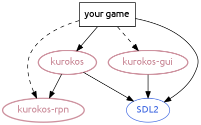
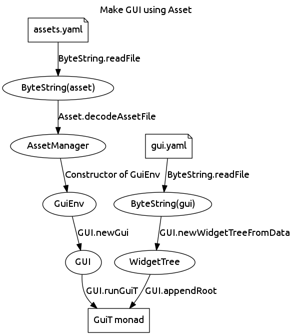

# kurokos

WIP

## 注意！
Kurokosは開発中であり、APIは頻繁に変更されます!

まだ実際のゲーム開発に利用するべきではありません。

## Dependencies



## Features
- Frame management
- Scene management
- GUI (Graphical User Interface)

# Install SDL2

## Windows

### Install Msys2
[http://www.msys2.org/](http://www.msys2.org/)

### Install libraries
```sh
pacman -S mingw64/mingw-w64-x86_64-SDL2
```

### Environment

最新バージョンでは実行時にエラーが発生（17/11/26）

以下のバージョンで動作検証している。

| Library    | Version  |
|:-----------|:---------|
| SDL2       | 2.0.4-1  |

## Ubuntu

```sh
sudo apt-get install libsdl2-dev
# freetype2
```

# Demo

## 1. フォントファイルを用意する

### 自動

```
sh setup-font.sh
```

### マニュアル

https://ja.osdn.net/projects/mplus-fonts/downloads/62344/mplus-TESTFLIGHT-063.tar.xz/
をダウンロードし、`_data/font/`内に解凍した全てのTTFファイルを配置する。

## 2. コンパイルと実行

```sh
stack build --flag=kurokos:demo
stack exec demo
```

# Memo

## Make GUI using Asset



# TODOs

### GUI
- [x] Stack Container
- [ ] Scroll Container
- [x] Load GUI from file
- [x] Image View
- [ ] Text Area
- [ ] Text Field (Editable)
- [ ] Segmented Control (Radio Button)
- [ ] Select by cursor buttons (using zipper?)

### Others
- [x] File Archiver
- [ ] Localization Manager
- [ ] Asset Manager
- [ ] Effect System (ex. Particle)
